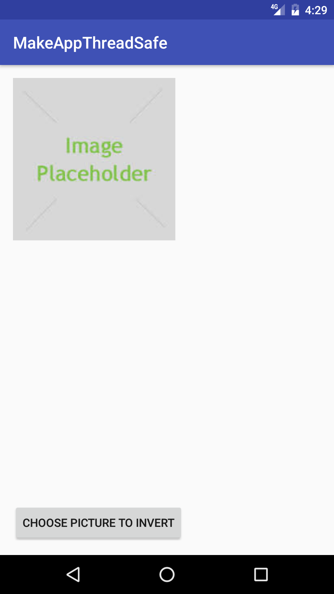
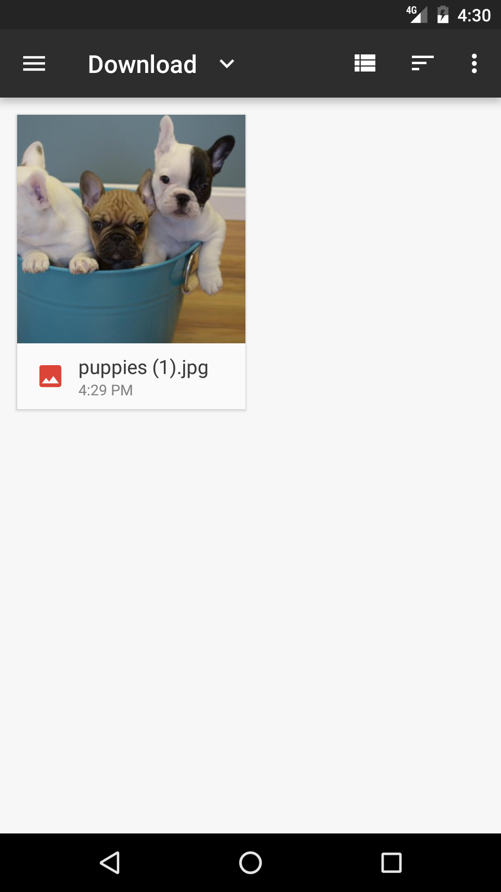
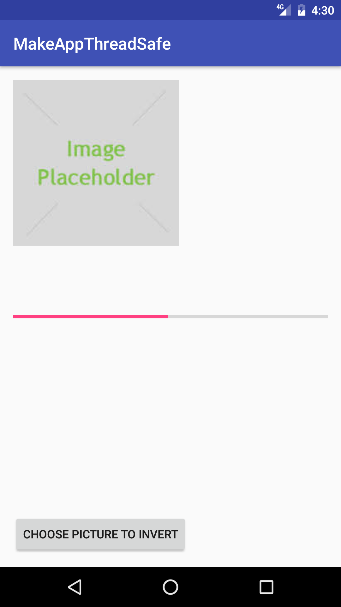
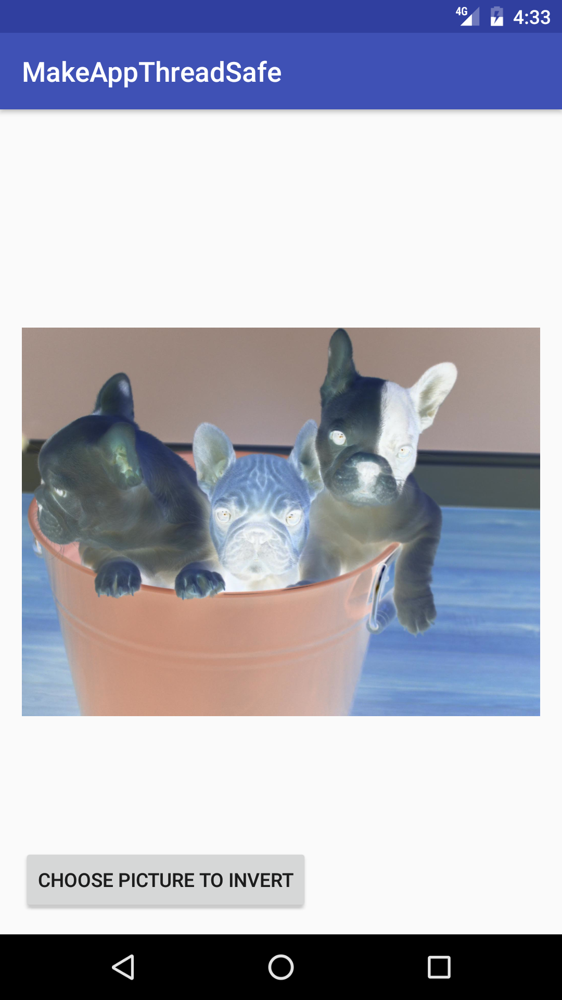

#  Threading Lab: Image Processing

## Introduction

> ***Note:*** _This can be done independently or with a partner._

In this lab, you will be using the starter code provided to finish an app that takes a selected image from your device, inverts all of the colors, and displays the modified image on the screen. Modifying the image will be very slow, so you'll need to do that work on a background thread. You'll also need to show a progress bar displaying how far along the image processing is, which must be updated on the UI thread. You'll need to use `AsyncTask` carefully to make sure everything happens on the correct thread.

In addition to getting practice with threading, you will also get some practice using bitmaps. The [Bitmap object](http://developer.android.com/reference/android/graphics/Bitmap.html) in Android is just a Java object that contains all of the data for an image, including access to the properties for each pixel in the image. The following methods are all you need to complete the section of the lab for manipulating the Bitmap.

- [getPixel](http://developer.android.com/reference/android/graphics/Bitmap.html#getPixel(int,int)
- [Color.red](http://developer.android.com/reference/android/graphics/Color.html#red(int)
- [Color.blue](http://developer.android.com/reference/android/graphics/Color.html#blue(int)
- [Color.green](http://developer.android.com/reference/android/graphics/Color.html#green(int)
- [Color.argb](http://developer.android.com/reference/android/graphics/Color.html#argb(int,int,int,int)
- [setPixel](http://developer.android.com/reference/android/graphics/Bitmap.html#setPixel(int,int,int)

## Exercise

#### Requirements

- use an AsyncTask to perform the image processing on a worker thread
- reverse the colors for a chosen bitmap
- display the modified image on the screen
- display a progress bar for the image processing

**Bonus**

- Perform additional image processing effects, such as black & white, blur, sepia, etc.

#### Starter code

Import the [starter code](starter-code) provided.  Fill in all of the areas that have a "TODO" next to it. Some of the AsyncTask is complete for you.

#### Deliverable

An app that meets the requirements above. If you work with a partner, only one person needs to submit, but put both names in the pull request title. See the screenshots below for some inspiration:

  
  
  
  

#### Resources

- [Bitmap Objects](https://developer.android.com/reference/android/graphics/Bitmap.html)
- [ASyncTask](https://developer.android.com/reference/android/os/AsyncTask.html)

---

## Licensing
1. All content is licensed under a CC­BY­NC­SA 4.0 license.
2. All software code is licensed under GNU GPLv3. For commercial use or alternative licensing, please contact [legal@ga.co](mailto:legal@ga.co).
